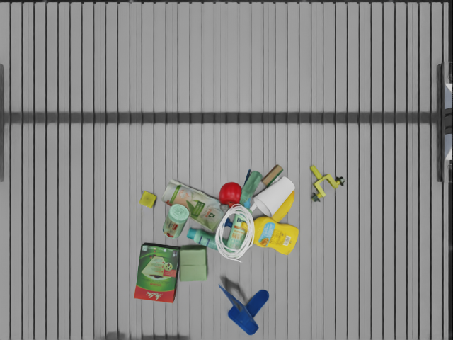
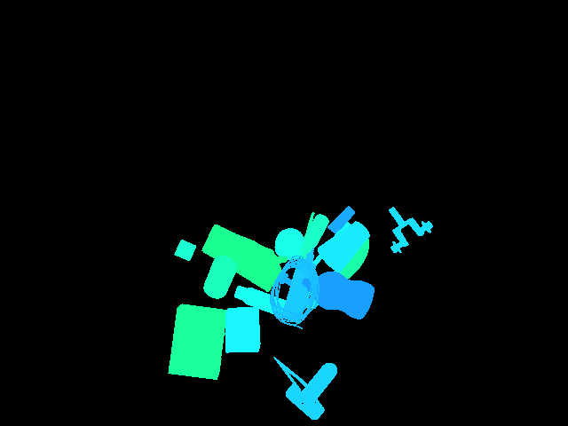
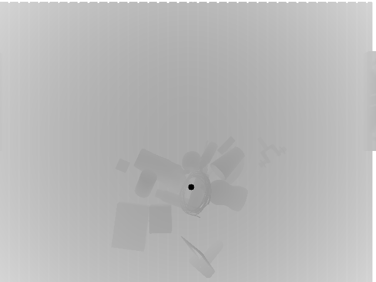
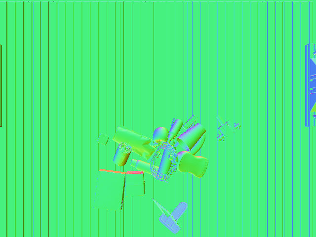
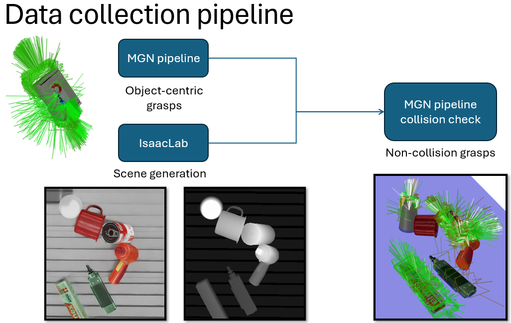
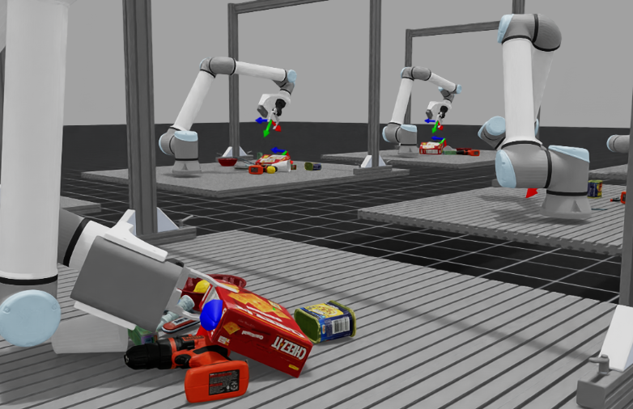

# MetaIsaacGrasp: IsaacLab for Supersed / Reinforcement learning

A test-bench for grasp learning including: 

- Data generation `AIR-v0-Data`
- Policy evaluation `AIR-v0-Grasp`
- Teleoperation `AIR-v0-Tele`
- Reinforcement learning (In progress)`AIR-v0-Cont`

#### Click to watch the demo video (Inference with remote agent functionality by [vMF-Contact](https://github.com/YitianShi/vMF-Contact))

[](https://www.youtube.com/watch?v=FSXTWSLbo68)

<div align="center">
<p float="left">
  
   
  
  
</p>
<p>Captured images: RGB, Segmentation, Depth, Normals</p>
</div>

## New features compared to old version:

1. Now support collision check and visualization of non-collision grasps (adapted from MGN)
<div align="center">


<p>Non-collision grasp generation pipeline</p>
</div>

2. Both one-grasp-per-image and continuous learning supported
3. Camera on hand and random camera view
4. NVIDIA Warp for state machine maintainance
5. Teleoperation environment (`AIR-v0-Tele`)
6. Remote grasp agent to work around the environment conflict 

<div align="center">

<p>Current state</p>
</div>


## Getting started


Make sure you already installed the Isaac-Sim in proper manner.

Install Isaac Lab following the [installation tutourial](https://isaac-sim.github.io/IsaacLab/main/source/setup/installation/pip_installation.html#installing-isaac-sim). Please make sure that is under your home directory: `~/IsaacLab` and following environment variables are added into `.bashrc`:

```
# Isaac Sim root directory
export ISAACSIM_PATH="${HOME}/.local/share/ov/pkg/isaac-sim-4.2.0"
# Isaac Sim python executable
export ISAACSIM_PYTHON_EXE="${ISAACSIM_PATH}/python.sh"
# Isaac Lab path
export LAB_PATH="${HOME}/IssacLab$LAB_PATH"
# Add Isaac Lab's sh path for convenience when runing: isaaclab -p *.py
alias isaaclab=/home/{user_name}/IsaacLab/isaaclab.sh
```
Download robot and work cell from:
```
omniverse://nucleus.ifl.kit.edu/Users/yitian/models/models_ifl
```

and unzip under the project directory (please ask the author for the access right).

Create symbolic link to your isaac sim by:

```
ln -s path_to_isaac_sim _isaac_sim
```
This is adapted from [tutourial for binary installation](https://isaac-sim.github.io/IsaacLab/main/source/setup/installation/binaries_installation.html) 

Now the vscode debugging is supported by pressing `Ctrl+Shift+P`, selecting `Tasks: Run Task` and run `setup_python_env`

You can change to headless mode as you wish. The `num_envs` decide how many scenes will be set up on the same stage.

!!If you cause core dump due to camera setting please run following command:

```
sudo prime-select nvidia
```

in case your 

```
sudo prime-select query
```

returns `on-demand`

## MetaGraspNet objects [available](https://github.com/maximiliangilles/MetaGraspNet/tree/master?tab=readme-ov-file)

Objects are now adapted from [models](https://nx25922.your-storageshare.de/s/9KrFffzwoTmtapR). Unzip under the same directory and run `isaaclab -p urdf_converter.py` to convert all URDF files into USD files.  

(!!Now new Isaac Lab commit support direct importing urdf in the simulation, so this step not necessary anymore, only in case that the user need usd files.)


Alternatively you can find the objects under: 

```
omniverse://nucleus.ifl.kit.edu/Users/yitian/models/models_ifl
```


