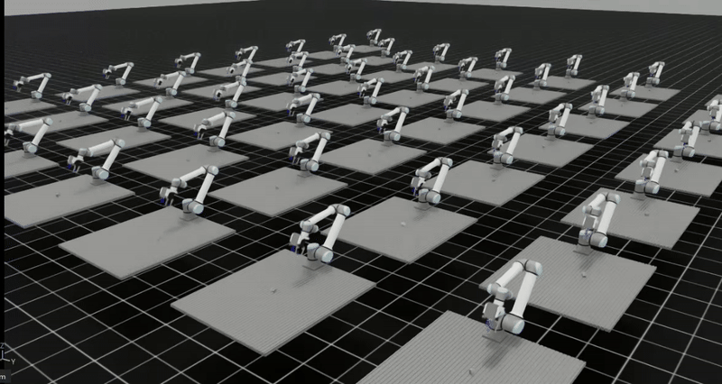

# MetaIsaacGrasp: IsaacLab for Supervised / Reinforcement learning (Support IsaacLab 2.0 and IsaacSim 4.5)

A data generation engine and test bench for grasp learning, powered by [IsaacLab](https://github.com/isaac-sim/IsaacLab) and [MetaGraspNetv2](https://github.com/maximiliangilles/MetaGraspNet) (MGN) including: 

- Data generation `AIR-v0-Data`
- Policy evaluation `AIR-v0-Grasp`
- Teleoperation `AIR-v0-Tele`
- Reinforcement learning `AIR-v0-RL`

### New features:

1. RL support with `stable baseline3` with `AIR-v0-RL`
2. Support IsaacLab 2.0 and IsaacSim 4.5.0
3. Both single-shot grasp execution and continuous learning supported
4. Teleoperation environment `AIR-v0-Tele`
5. Remote grasp agent to work around the environment conflict (see [vMF-Contact](https://github.com/YitianShi/vMF-Contact)))

<div align="center">

<p>Grasp learning data collection and test bench</p>
</div>

<div align="center">
  
  <p style="font-size: 12px;">Reinforcement learning with stable baseline3</p>
</div>

#### Demo video (Inference with remote agent functionality by [vMF-Contact](https://github.com/YitianShi/vMF-Contact))

(*Click to watch, all the successfully grasped objects will be put under the table.)

[](https://www.youtube.com/watch?v=FSXTWSLbo68)

#### Teleoperation

[](https://www.youtube.com/watch?v=XxlxfCCyMCE)

Our teleoperation may also supported by vMF-Contact to reach objects:

[](https://www.youtube.com/watch?v=SV-5fFmEhaA)

<div align="center">
<p float="left">
  
   
  
  
</p>
<p>Captured images: RGB, Segmentation, Depth, Normals</p>
</div>

## Getting started


Make sure you already installed the Isaac-Sim in proper manner.

Install Isaac Lab following the [installation tutourial](https://isaac-sim.github.io/IsaacLab/main/source/setup/installation/pip_installation.html#installing-isaac-sim). Please make sure that is under your home directory: `~/IsaacLab` and following environment variables are added into `.bashrc`:

```
# Isaac Sim python executable
export ISAACSIM_PYTHON_EXE="${ISAACSIM_PATH}/python.sh"
# Add Isaac Lab's sh path for convenience when runing: isaaclab -p *.py
alias isaaclab=/home/{user_name}/IsaacLab/isaaclab.sh
```

## MetaGraspNet objects [available](https://github.com/maximiliangilles/MetaGraspNet/tree/master?tab=readme-ov-file)

Objects are now adapted from [models](https://nx25922.your-storageshare.de/s/9KrFffzwoTmtapR). Unzip under the same directory and run `isaaclab -p urdf_converter.py` to convert all URDF files into USD files (!!! Please use isaaclab 1.4 version for urdf conversion since this is now out-of-date for isaaclab 2.0!). We don't use original USD files since all the collision meshes are in convex hall, which are unrealistic.

## VSCode development

We provide the vscode debugging setup and setting file in ´.vscode´, please replace ´home/yitian´ with your home path.

## Potential Issues

If you cause core dump due to camera setting please run following command:

```
sudo prime-select nvidia
```

in case your 

```
sudo prime-select query
```

returns `on-demand`

## Citation

Please cite our paper which uses the whole framework for reference:

```
@article{shi2024vmf,
  title={vMF-Contact: Uncertainty-aware Evidential Learning for Probabilistic Contact-grasp in Noisy Clutter},
  author={Shi, Yitian and Welte, Edgar and Gilles, Maximilian and Rayyes, Rania},
  journal={arXiv preprint arXiv:2411.03591},
  year={2024}
}
```
Funded by the Deutsche Forschungsgemeinschaft (DFG, German Research Foundation) – SFB 1574 – 471687386
